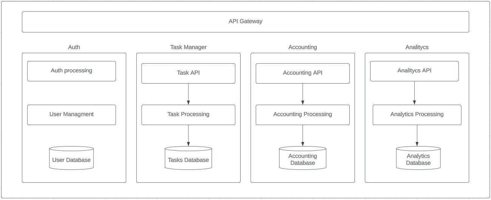
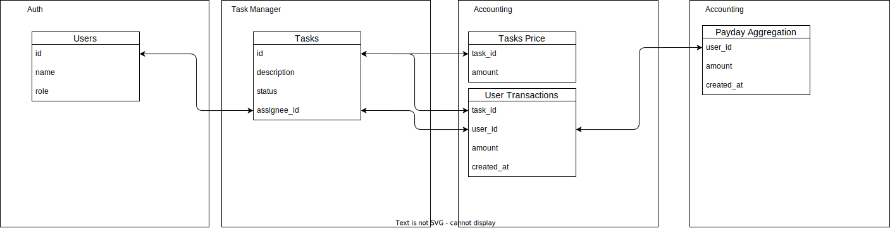
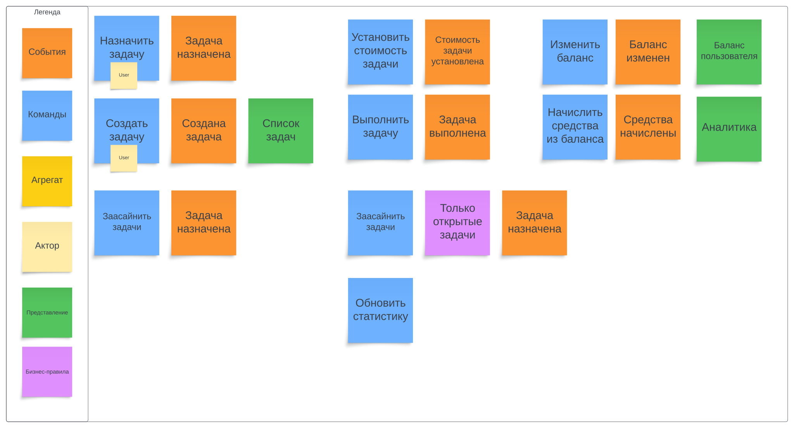
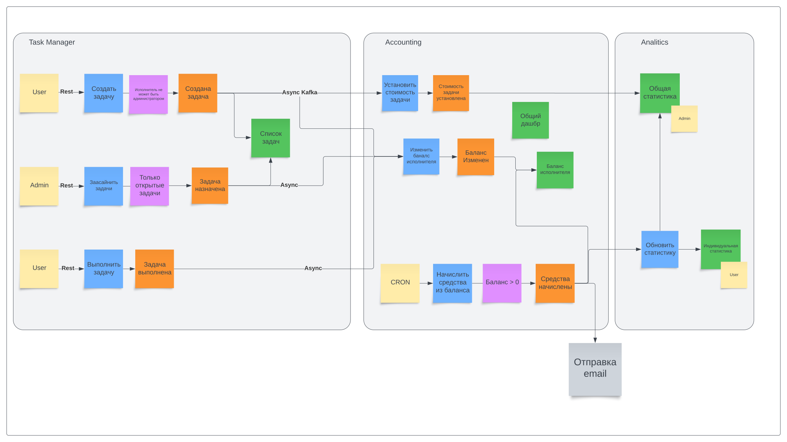

## Сервисы

- **Auth** - Внешний сервис авторизации;
- **Task Manager** - Сервис, манипулирующий задачами;
- **Accounting** - Сервис, отвечающий за расчет; стоимости задач и выплаты исполнителям;
- **Analytics** - Сервис, агрегирующий данные для аналитики.

##  Данные и их связь между контекстами

### Event Storming и Коммуникация между сервисами

## Потенциальные проблемы
- Множественные списания при реасане задач. Списания средств будет происходить с каждого попуга за одну и ту же задачу, при этом средства во время реасайна не возврающаются прошлому исполнителю.
- Буйный попуг добавил карточку "Общий дашбр" в аккаунтинг